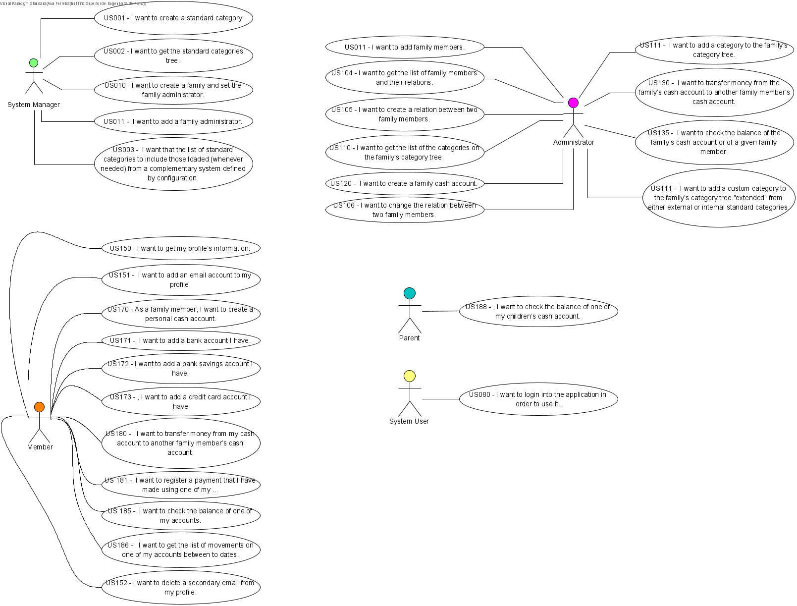

## Contents
- [Architecture Background](#architecture-background)
  - [Problem Background](#problem-background)
    - [System Overview](#system-overview)
    - [Context](#context)
    - [Driving Requirements](#driving-requirements)
      - [Functional Requirements](#functional-requirements)
      - [Quality attributes](#quality-attributes)
        - [Functionality](#functionality)
        - [Usability](#usability)
        - [Reliability](#reliability)
        - [Performance](#performance)
        - [Supportability](#supportability)
  - [Design Constraints](#design-constraints)
  - [Implementation constraints](#implementation-constraints)
- [Architectural Approaches](#architectural-approaches)
    - [Analysis Results](#analysis-results)
    - [Mapping Requirements to Architecture](#mapping-requirements-to-architecture)

# Architecture Background
>Architecture Background provides information about the software architecture, by:
>- describing the background and rationale for the software architecture;
>- explaining the constraints and influences that led to the current architecture;
>- describing the major architectural approaches that have been utilized in the architecture.

## Problem Background
>The sub-parts of this section explain the constraints that provided the significant influence over the architecture.

### System Overview
> This section describes the general function and purpose for the system or subsystem whose architecture is described in this SAD.

It is intended to create a system that helps families manage their finances.

### Context
> This section describes the goals and major contextual factors for the software architecture. The section includes a description of the role software architecture plays in the life cycle, the relationship to system engineering results and artifacts, and any other relevant factors.

SWitCH Soft (SWS) aims to develop an application to support family finance management. This is an important issue, as there are many families who have financial problems due to mismanagement and lack of control over their income and expenses.

### Driving Requirements
> This section lists the functional requirements, quality attributes and design constraints. It may point to a separate requirements document.

#### Functional Requirements

 SPRINT 1
 
  - US001 As a system manager, I want to create a standard category.
  - US002 As a system manager, I want to get the standard categories tree.
  - US010 As a system manager, I want to create a family and set the family administrator.
  - US101 As a family administrator, I want to add family members.
  - US104 As a family administrator, I want to get the list of family members and their relations.
  - US105 As a family administrator, I want to create a relation between two family members.
  - US110 As a family administrator, I want to get the list of the categories on the family’s category tree.
  - US120 As a family administrator, I want to create a family cash account. 
  - US150 As a family member, I want to get my profile’s information.
  - US151 As a family member, I want to add an email account to my profile

 SPRINT 2

 - US106 As a family administrator, I want to change the relation between two family members.
 - US111 As a family administrator, I want to add a category to the family’s category tree.
 - US130 As a family administrator, I want to transfer money from the family’s cash account to another family member’s cash account.  
 - US135 As a family administrator, I want to check the balance of the family’s cash account or of a given family member.
 - US170 As a family member, I want to create a personal cash account.
 - US171 As a family member, I want to add a bank account I have. 
 - US172 As a family member, I want to add a bank savings account I have.
 - US173 As a family member, I want to add a credit card account I have.
 - US180 As a family member, I want to transfer money from my cash account to another family member’s cash account. 
 - US181 As a family member, I want to register a payment that I have made using one of my cash accounts.
 - US185 As a family member, I want to check the balance of one of my accounts.
 - US186 As a family member, I want to get the list of movements on one of my accounts between to dates. 
 - US188 As a parent, I want to check the balance of one of my children’s cash account.

 SPRINT 6

 - US003 As a System Manager I want that the list of standard categories to include those loaded (whenever needed) from a complementary system defined by configuration.
 - US111v2 As a Family Administrator, I want to add a custom category to the family’s category tree "extended" from either external or internal standard categories.
 - US080 As a System User, I want to login into the application in order to use it.

 SPRINT 7

 - US152 As a family member, I want to delete a secondary email from my profile.

SPRINT 6 AND 7 - USER STORIES IMPLEMENTED ON THE WEB APPLICATION

 - US010 As a system manager, I want to create a family and set the family administrator.
 - US101 As a family administrator, I want to add family members.
 - US104 As a family administrator, I want to get the list of family members and their relations.
 - US105 As a family administrator, I want to create a relation between two family members.
 - US150 As a family member, I want to get my profile’s information.

 - US106 As a family administrator, I want to change the relation between two family members.
 - US152 As a family member, I want to delete a secondary email from my profile.

#### Quality attributes

The quality attributes are categorized and organized according to the model [FURPS+](https://pt.wikipedia.org/wiki/FURPS).

##### Functionality
1. Each system can only access their respective data.
2. The integrity of the information accessed by the systems should be verified and audited.
3. Regarding the need of learning and knowing, all the information should be protected from unwanted access. In other words, the principle of minimizing access to what is essential to each user/application, creating tunels to transfer information, evaluate the data and applications integrity, and data encryption/minimization.

##### Usability
5. The Single Page Application (SPA) should allow the access to every module in the system.

##### Reliability
n/a

##### Performance
n/a

##### Supportability

7. Although it is not a required, the architecture of the solution should take into account, the future extension for mobile applications.

## Design Constraints

8. The system consists in a Single Page Application (SPA) the perception and navigability of separate logical pages.
9. The Data Base is used to manage users and thus there is no need of a users' management module.
10. Although it is not a required, the architecture of the solution should take into account, the future extension for mobile applications.

## Implementation constraints

The modules that constitute the SPA have the same source code and are made available as a single artifact.

# Architectural Approaches
> This section provides a rationale for the major design decisions embodied by the software architecture. It describes any design approaches applied to the software architecture, including the use of architectural styles or design patterns, when the scope of those approaches transcends any single architectural view. The section also provides a rationale for the selection of those approaches. It also describes any significant alternatives that were seriously considered and why they were ultimately rejected. The section describes any relevant COTS issues, including any associated trade studies.

Based on the non-functional requirements and design constraints, the following approaches/styles/patterns/ will be adopted:

- Client-Server, because the 'Back-end' serves the 'Front-end'. The back-end is also the client of groups 1 and 3.
- Web Application, in which the frontend is an SPA (Single Page Application), and the Backend;
- SOA, because the servers (cf. anterior) ought to provide API, in particular API to be used in the web, services provided to the respective clients. The levels 0, 1, 2 and 3 of the model [Modelo de Maturidade de Richardson](https://martinfowler.com/articles/richardsonMaturityModel.html) applies to rest, will be adopted;
- N-Tier, because the applications should be deployed in different machines *on premises* and IaaS and PaaS (*on cloud*), according to the non-functional requirements;
- Layered architecture, more specifically, Onion Architecture.

Other approaches/styles/patterns/, such as interconnection between applications based on message-events were not considered as to not violate the defined requirements and restrictions, and for academic reasons as well.

### Analysis Results
> This section describes the results of any quantitative or qualitative analyses that have been performed that provide evidence that the software architecture is fit for purpose. If an Architecture Tradeoff Analysis Method evaluation has been performed, it is included in the analysis sections of its final report. This section refers to the results of any other relevant trade studies, quantitative modeling, or other analysis results.

So far, there are no results from analysis or evaluation. Qualitative studies regarding the adopted styles/patterns (namely, the Onion Architecture), vouch for the high maintainability, evolvability, and testability, and, at the same time, allow the achieving of the desired functionalities.
### Mapping Requirements to Architecture
> This section describes the requirements (original or derived) addressed by the software architecture, with a short statement about where in the architecture each requirement is addressed.

TBD