# Views

## Introduction

The C4 model, and the architectural view 4+1 model were used to represent and visualize the software architecture.
The views that compose the 4+1 model describe a system in such a way that they complement each other.

This model has four views (the logical, the physical, the development, and the process view) and, additionally (hence the '+1' view), certain scenarios or use cases can be selected to illustrate the architecture.
The views of this model can be described in further, detail according to their purpose:

- The Logical View- pertains to the functional requirements,i.e., to what services are to be provided to the system's users.
- The Physical View or Deployment View-  it concerns the topology of the software components and connections between them, in other words, it describes the mapping of the software onto the hardware.
- The Development View- Depicts the organization of the software and is associated with software management.
- The Process View- relates to the dynamic aspects of the system, addresses the flow of information and task concurrency, performance, etc.[[1]](References.md)[[2]](References.md)

The C4 model consists in decomposing a system into 4 different levels of abstraction:

- context;
- containers;
- components;
- code;

### Level 1

##### Logical View
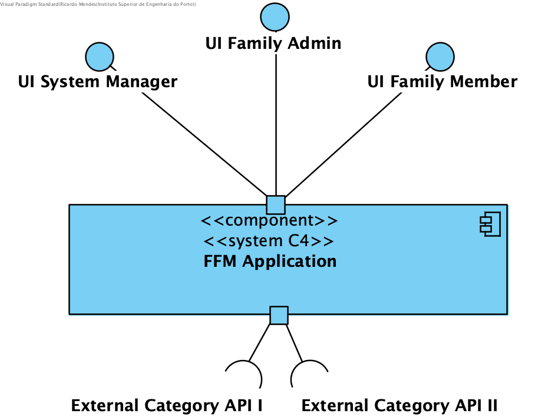

##### Process View

SSD US Options

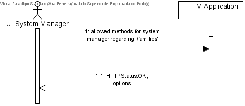

SSD US Delete

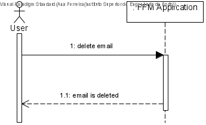

SSD US Get

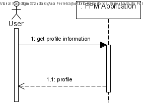

SSD US Post

SSD US GET EXT

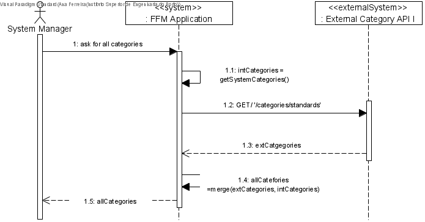

### Level 2

##### Logical View

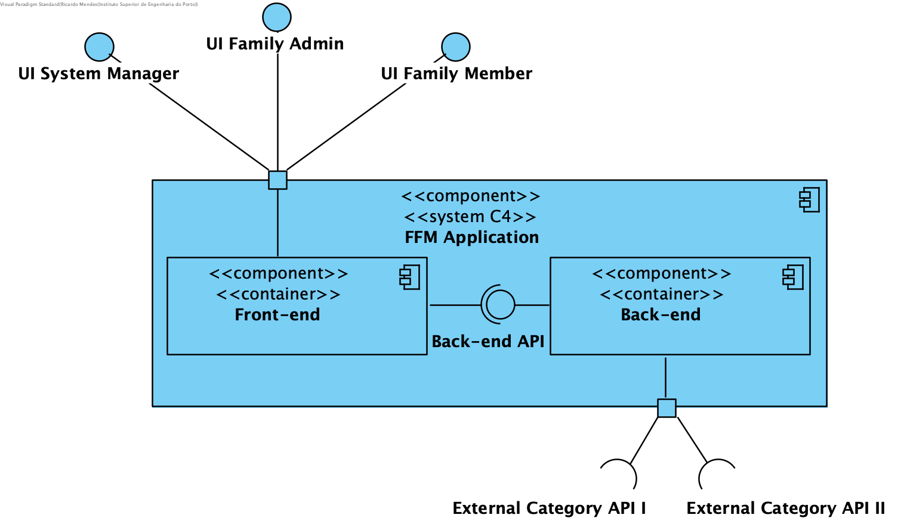

##### Process View

SSD US Options

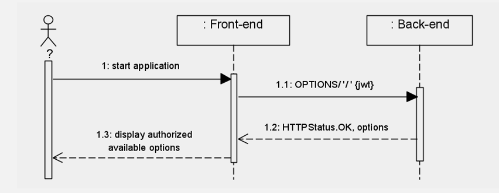

SSD US Delete

SSD US Get

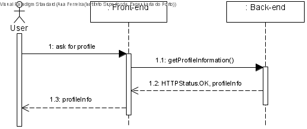

SSD US Post

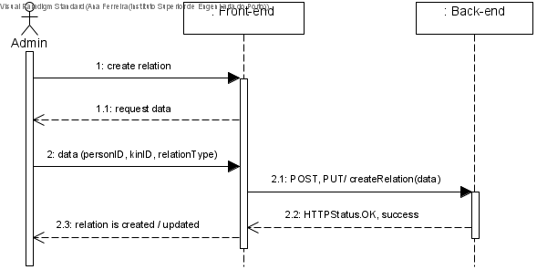

SSD US Get External API

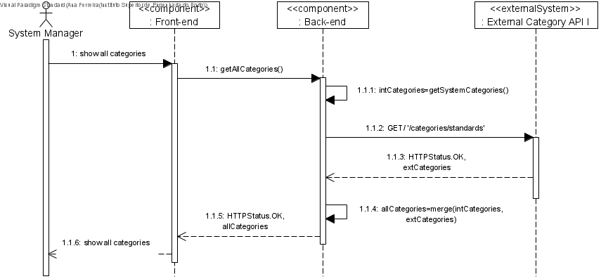

##### Implementation View
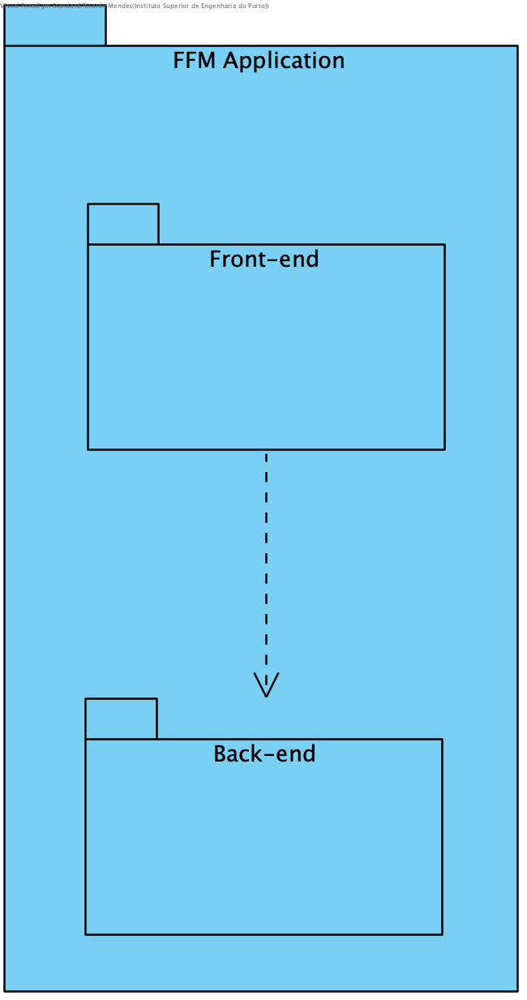

##### Deployment View

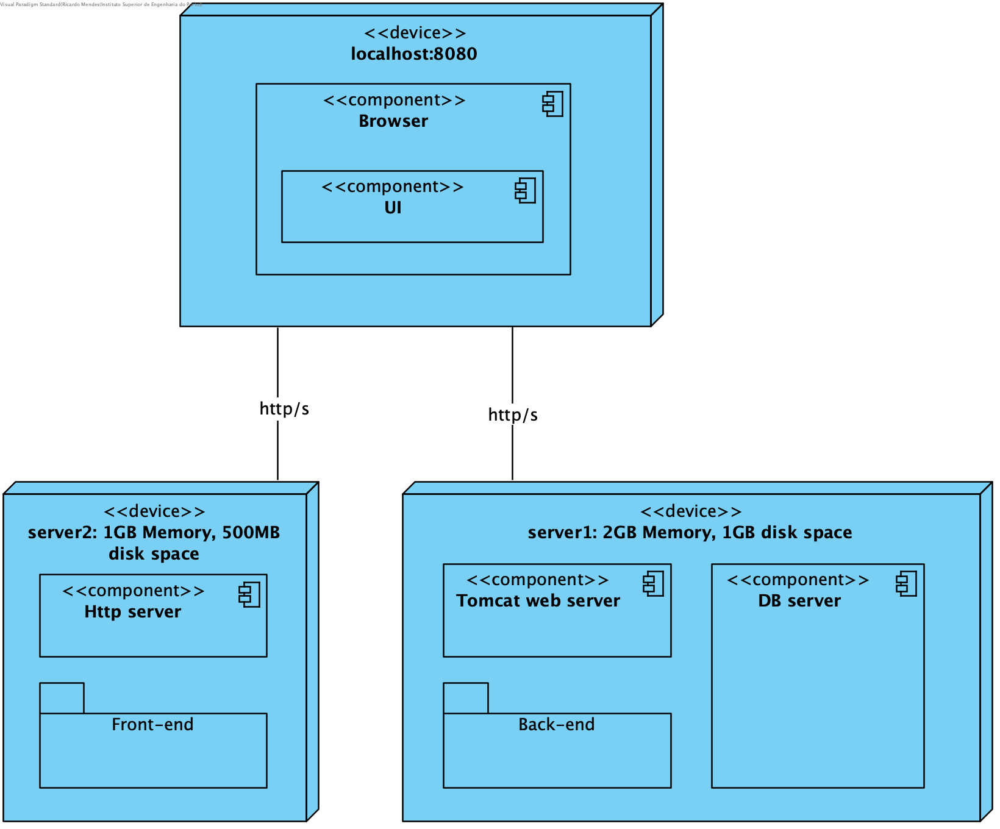

## Level 3

##### Logical View

##### Implementation View

## Level 5 
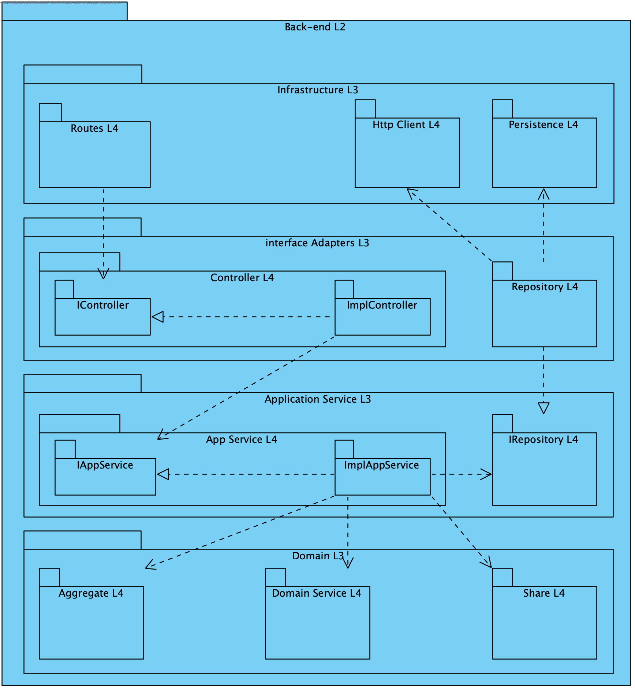

